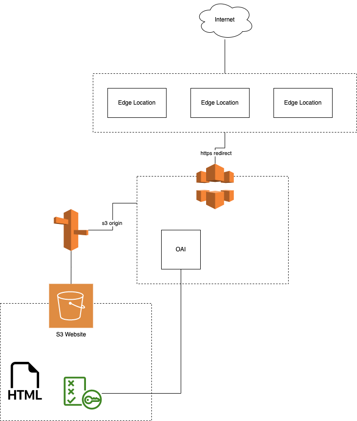

# CDN and S3 Origin Terraform Example

You can use this project as a reference for Cloudfront and S3 origin boilerplate

## Architecture



## AWS config

This project is configured to find aws credentials based on the profile you set it

Example on `dev.tfvars`
```
aws_profile = "dev-ed"
```

*See [AWS cli configuration basics](https://docs.aws.amazon.com/cli/latest/userguide/cli-configure-quickstart.html)*


## Develop
Initialize terraform
```
$ terraform init
```
Verify desired state in `dev`
```
$ terraform plan -var-file="dev.tfvars"
```

## Deploy
```
$ terraform apply -var-file="dev.tfvars"
```

## Notes

- I was using Cloud Guru's free AWS sandbox to test to avoid unnecessary costs
    - Limitations
        - Registering a domain and ACM Cert validation is not allowed
        - > Ideally we alias a nice name to the cn distro, this part I'm not able to test for free
- Had a minor challenge [see my question on Stackoverflow](https://stackoverflow.com/questions/75438001/terraform-aws-s3-bucket-object-call-to-function-filemd5-failed-open-file/75440212#75440212)
- Overall I had fun 

## Demo
- See https://youtu.be/x5cIlQV7vbQ
